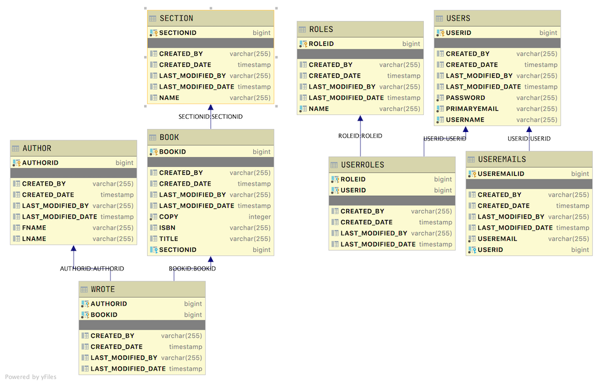

# Java Frameworks Sprint Challenge

**Read these instructions carefully. Understand exactly what is expected _before_ starting this Sprint Challenge.**

This challenge allows you to practice the concepts and techniques learned over the past sprint and apply them in a concrete project. This sprint explored **using Frameworks in Java**. During this sprint, you studied **SQL, Spring Data, JPA, and Hibernate**. In your challenge this week, you will demonstrate your mastery of these skills by creating **a Java Spring REST API Application**.

This is an individual assessment. All work must be your own. Your challenge score is a measure of your ability to work independently using the material covered through this sprint. You need to demonstrate proficiency in the concepts and objectives introduced and practiced in preceding days.

You are not allowed to collaborate during the sprint challenge. However, you are encouraged to follow the twenty-minute rule and seek support from your TL if you need direction.

_You have **three hours** to complete this challenge. Plan your time accordingly._

## Introduction

This is a basic bookstore database scheme with books which have authors. The book can be found in a section of the store.

### MVP

- Implement Security For the routes
  - GET /books/books
  - GET /books/book/{id}
  - POST /books/book
  - PUT /books/book/{id}
  - DELETE /books/book/{id}

- Testing the methods

  - Book Service:
    - findAll
    - findBookById that succeeds
    - findBookById that fails
    - delete
    - save a new book

  - Book Controller:
    - listAllBooks
    - getBookById that succeeds
    - getBookById that fails
    - addNewBook
    - deleteBookById

- Using custom exception handlers

- Deploying to Heroku using PostgreSQL

### Commits

Commit your code regularly and meaningfully. This helps both you (in case you ever need to return to old code for any number of reasons) and your team lead as the evaluate your solution.

Be prepared to demonstrate your understanding of this week's concepts by answering questions on the following topics. You might prepare by writing down your own answers before hand.

1. Can you explain exception handling in your application?
2. Can you explain your user authentication flow?
3. Can you show me your unit tests and describe how they work?
4. Can you show how you deployed your application to a cloud service with a persistent database?

## Instructions

### Task 1: Project Set Up

- [ ] Create a forked copy of this project
- [ ] Add your team lead as collaborator on Github
- [ ] Clone your OWN version of the repository (Not Lambda's by mistake!)
- [ ] Create a new branch: git checkout -b `<firstName-lastName>`.
- [ ] Create a new Java Spring Application using IntelliJ.
- [ ] Push commits: `git push origin <firstName-lastName>`
- [ ] Implement the project on your newly created `<firstName-lastName>` branch, committing changes regularly
- [ ] Push commits: git push origin `<firstName-lastName>`

### Task 2: Project Requirements

- [ ] You will be creating a REST api service to store and read data from a database. You should be able to switch between an H2 database and a PostgreSQL database by using an application.properties setting.

- [ ] Please fork and clone this repository. This repository does have a starter project. The provided initial application has the basics in place. Note that if you start with the initial project, all the following are done for you!!!

- Auditing fields
- Exception Handling
- User Oauth2 Authentication
  - Endpoints to handle (know how these work)
    - Creating a new user
    - Updating a user
    - Deleting a user
    - Authenticated user logging out
    - plus many more!
- Swagger
- Unit / Integration testing (at least the POM file entries and general structure)
- The database is already modeled for you

- **You are tasked to do the following**

- [ ] Currently, Books are not addressed in security so those routes cannot be accessed. Setup security so that the following access is available:
  - [ ] GET /books/books - any user with the role ADMIN or DATA can access
  - [ ] GET /books/book/{id} - any user with role ADMIN or DATA can access
  - [ ] POST /books/book - any user with role ADMIN can access
  - [ ] PUT /books/book/{id} - any user with role ADMIN can access
  - [ ] DELETE /books/book/{id}

- [ ] When a client tries searching for or updating a book that does not exist, a generic exception is sent back to the client. Change this so our custom exception ResourceNotFoundException is returned instead.

- [ ] Add unit test for the Book Service using the database as test data. The structure is already in place, you just need to write the tests for the following:
  - [ ] findAll
  - [ ] findBookById that succeeds
  - [ ] findBookById that fails
  - [ ] delete
  - [ ] save a new book

- [ ] Add unit tests for the Book Controller NOT relying on the database as test data. The structure is already in place, you need to set up the data and write the tests for the following:
  - [ ] listAllBooks
  - [ ] getBookById that succeeds
  - [ ] getBookById that fails
  - [ ] addNewBook
  - [ ] deleteBookById

- [ ] And now that we have a good system, deploy the system to Heroku using PostgreSQL. Your application should be switchable between H2 and PostgreSQL through setting a variable in application.properties

### Task 3: Stretch Goals

- [ ] Unit Testing
  - [ ] Write tests to achieve 100% line coverage in book service. This can be done either with or without connecting to the database.
  - [ ] Write tests to achieve 100% line coverage in book controller. This can be done either with or without connecting to the database.

### Required best practices

- [ ] Consistent naming. Examples: variables, functions, Components, and file/folder organization.
- [ ] Consistent spacing. Examples: line breaks, around arguments and before/after functions.
- [ ] Consistent quotation usage.
- [ ] Spell-check.
- [ ] Schedule time to review, refine and reassess your work.

It is better to submit a challenge that meets [MVP](https://en.wikipedia.org/wiki/Minimum_viable_product) than one that attempts too much and fails.

### Tips and Gotchas

A hint about the SeedData.java classes

1. When starting the app, use the seedata in the foundations package, it should load automatically
2. Test that the data populated and that you're able to get and use tokens
3. As you're writing your models and services for books, authors, and sections have the root seeddata open so that you're writing them the way that it's expecting
4. Once you have your models, controllers etc for books, authors and sections move the root seeddata down into foundations and comment out (or remove) the original one in the foundations.

In your solution, it is essential that you follow best practices and produce clean and professional results. You will be scored on your adherence to proper code style and good organization. Schedule time to review, refine, and assess your work and perform basic professional polishing including spell-checking and grammar-checking on your work. It is better to submit a challenge that meets MVP than one that attempts too much and does not.
